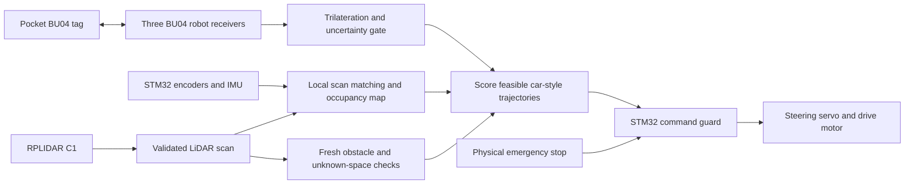

# RoboPack

RoboPack is a person-following robot built around a **Raspberry Pi, STM32, the existing chassis, a SLAMTEC RPLIDAR C1, and four BU04 UWB boards**: three receivers at known positions on the robot and one tag in the person's pocket.

The Pi estimates the robot's pose and builds a 2D LiDAR map, locates the selected tag from radio ranges, and scores feasible steering/speed trajectories. Collision checks reject unsafe candidates before scoring. The STM32 owns steering, motor speed control, and the final stop/watchdog behavior.

This repository replaces the earlier OpenCV/NanoDet camera preview. It contains a working C++17 navigation prototype, deterministic simulation/replay, sensor normalization, an optional C1 bench capture utility, and a portable C99 STM32 command guard.

## Architecture



The implemented SLAM is a bounded local scan-to-map estimator with an odometry prior. It has no loop closure or global route planner.

## Build and try it

On Raspberry Pi OS 64-bit, Debian, or Ubuntu:

```bash
bash scripts/install_deps.sh
bash scripts/build.sh
bash scripts/run_demo.sh
```

The core needs a C++17 compiler and CMake 3.20+. The demo prints CSV commands to show how the robot would work in the simulation.

Record and replay a synthetic run, including a tag dropout:

```bash
mkdir -p output
./build/robopack --demo --config config/robot.conf \
  --record output/demo.frames --map output/map.pgm > output/commands.csv
./build/robopack --replay output/demo.frames --config config/robot.conf
ctest --test-dir build --output-on-failure
```

The map is a PGM image: black occupied, white free, gray unknown.

## Repository layout

```text
include/robopack/      Sensor, map, tracking, navigation and protocol interfaces
src/                   C++ implementation and offline executable
controls/              Steering/throttle helpers and scored trajectory planner
adapters/              Optional C1 capture program using the official SDK
config/robot.conf      chassis, sensor geometry and control settings
firmware/stm32/        Portable C command guard; no board-specific HAL
tests/                 Navigation, adapter, replay and firmware regression tests
scripts/               Dependency installation, build/test and demo commands
CAD_Files/             Self-explanatory
```
